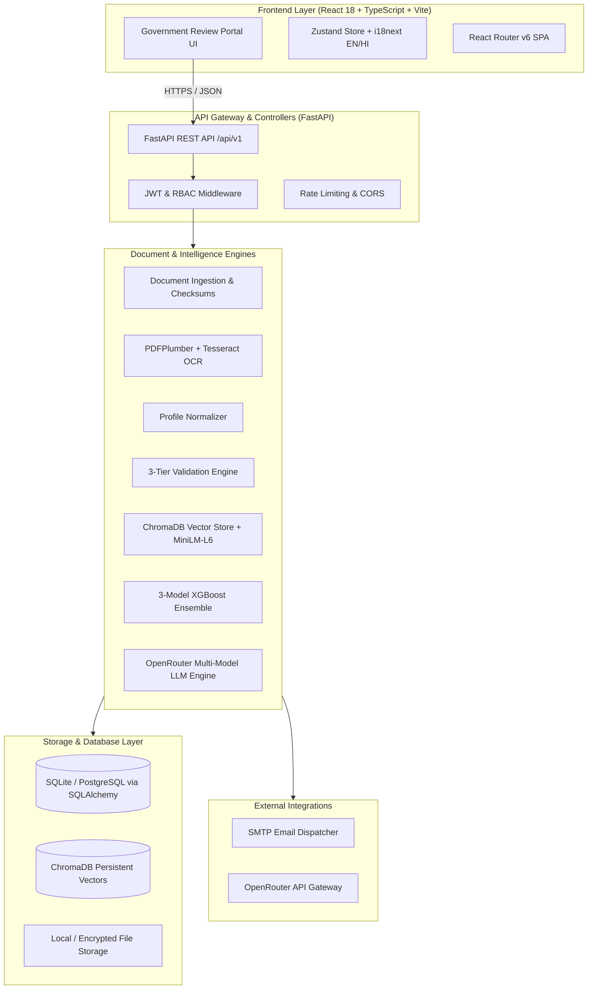
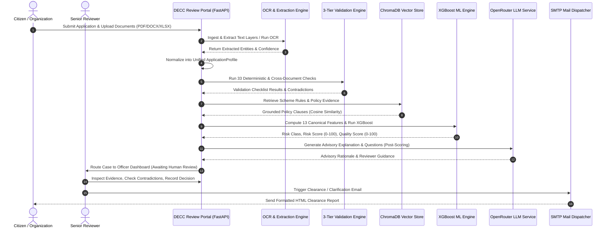
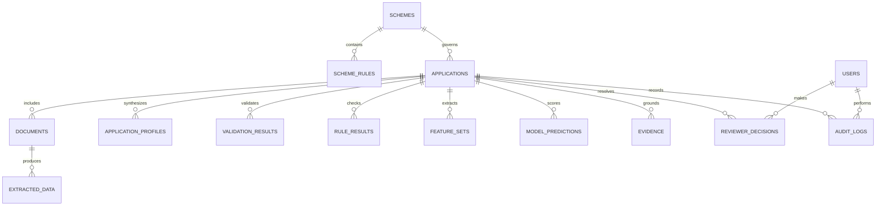

# Technical Architecture & System Documentation

**Project**: DECC Application Intelligence & Environmental Review Portal  
**Platform**: Government of Maharashtra — Directorate of Environment & Climate Change  
**Version**: 2.0.0 (Release-Ready)  
**Operating Principle**: *"AI Assists · Human Decides"*  

---

## 1. High-Level System Architecture



---

## 2. End-to-End Processing Pipeline

The 12-stage automated lifecycle executes deterministically upon application submission:



---

## 3. Machine Learning Pipeline & Feature Specifications

The machine learning subsystem utilizes **three independent XGBoost models** trained in Universal Binary JSON (`.ubj`) format:
1. `risk_classifier.ubj`: Multi-class classification (`LOW_RISK`, `MEDIUM_RISK`, `HIGH_RISK`).
2. `risk_regressor.ubj`: Continuous regression predicting risk index $[0.0, 100.0]$.
3. `quality_regressor.ubj`: Continuous regression predicting application quality index $[0.0, 100.0]$.

### 13 Canonical Features

| # | Feature Name | Range | Description & Calculation Source |
| :-: | :--- | :---: | :--- |
| 1 | `document_completeness` | $[0.0, 1.0]$ | Ratio of required scheme documents uploaded vs total mandatory documents. |
| 2 | `required_field_completeness` | $[0.0, 1.0]$ | Completeness ratio across mandatory profile fields. |
| 3 | `eligibility_pass_ratio` | $[0.0, 1.0]$ | Ratio of passed deterministic statutory eligibility checks. |
| 4 | `budget_consistency` | $[0.0, 1.0]$ | Cross-document budget reconciliation score (1.0 = exact match). |
| 5 | `certificate_validity` | $[0.0, 1.0]$ | Validity and format verification score of legal certificates. |
| 6 | `contradiction_count` | $[0, \infty)$ | Number of identified cross-document data conflicts. |
| 7 | `duplicate_similarity` | $[0.0, 1.0]$ | Cross-application SHA-256 and text similarity index. |
| 8 | `suspicious_indicator_count`| $[0, \infty)$ | Flags for unrealistic budgets ($> ₹1\text{ Cr}$), timeline anomalies, or circular names. |
| 9 | `document_quality` | $[0.0, 1.0]$ | Aggregate extraction OCR confidence across all attached pages. |
| 10| `proposal_quality` | $[0.0, 1.0]$ | Completeness and detail depth of environmental mitigation scope. |
| 11| `project_feasibility` | $[0.0, 1.0]$ | Budget vs timeline feasibility ratio against scheme thresholds. |
| 12| `environmental_impact` | $[0.0, 1.0]$ | Compliance alignment with coastal / environmental scheme goals. |
| 13| `extraction_confidence` | $[0.0, 1.0]$ | Mean confidence across entity extraction fields. |

---

## 4. Database Schema & Data Models

The relational persistence layer utilizes **SQLAlchemy 2.0 ORM** supporting SQLite and PostgreSQL across 18 core entities:



---

## 5. Security, Resilience & Fallback Architecture

### 5.1 Cloud LLM Resilience Matrix
```
[LLM Call Initiated]
        ↓
[Primary Model: z-ai/glm-5.2:free]
        ↓ (429 Rate Limit / 90s Timeout)
[Retry with Exponential Backoff (3s → 6s, 2 Retries)]
        ↓ (Still Failing)
[Fallback Model: openrouter/auto]
        ↓ (Fails)
[Graceful Degradation: AI_REASONING = "UNAVAILABLE"]
        ↓
Deterministic Validations (33 Checks) + XGBoost ML Scores 100% Preserved
```

### 5.2 Single-Source Consistency Safeguard
To eliminate false penalties for honest applicants submitting single documents:
- If Project Cost exists in *Proposal* but no *Budget Sheet* is uploaded $\rightarrow$ Consistency status = `NOT_VERIFIABLE` (Zero penalty, flagged for manual reviewer check).
- If Project Cost in *Proposal* ($₹32,40,000$) $\neq$ *Budget Sheet* ($₹45,00,000$) $\rightarrow$ Consistency status = `FAIL` (Flagged as Contradiction).

---

## 6. Email Service Architecture

The email subsystem renders responsive, table-based HTML email reports via Python's built-in `smtplib` and `email.mime`:
- **Deep Navy Header**: Government identity with dynamic status badge.
- **Application Summary Grid**: Two-column responsive summary of key application parameters.
- **Actionable Issue Cards**: Color-coded cards (Red for Failed Checks, Amber for Pending Items, Green for Approved Metrics).
- **Graceful Degraded Mode**: If SMTP credentials are not configured in `.env`, the system logs the dispatch intent without crashing the reviewer workflow.
